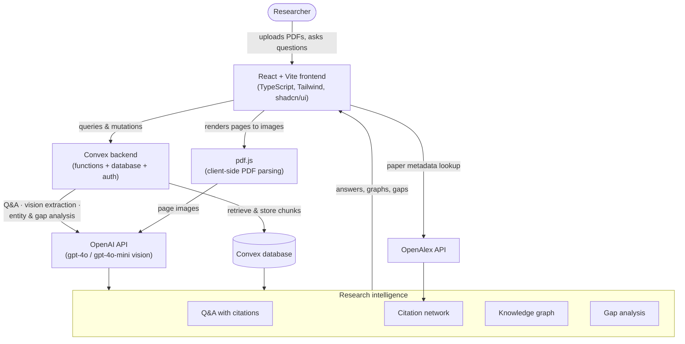
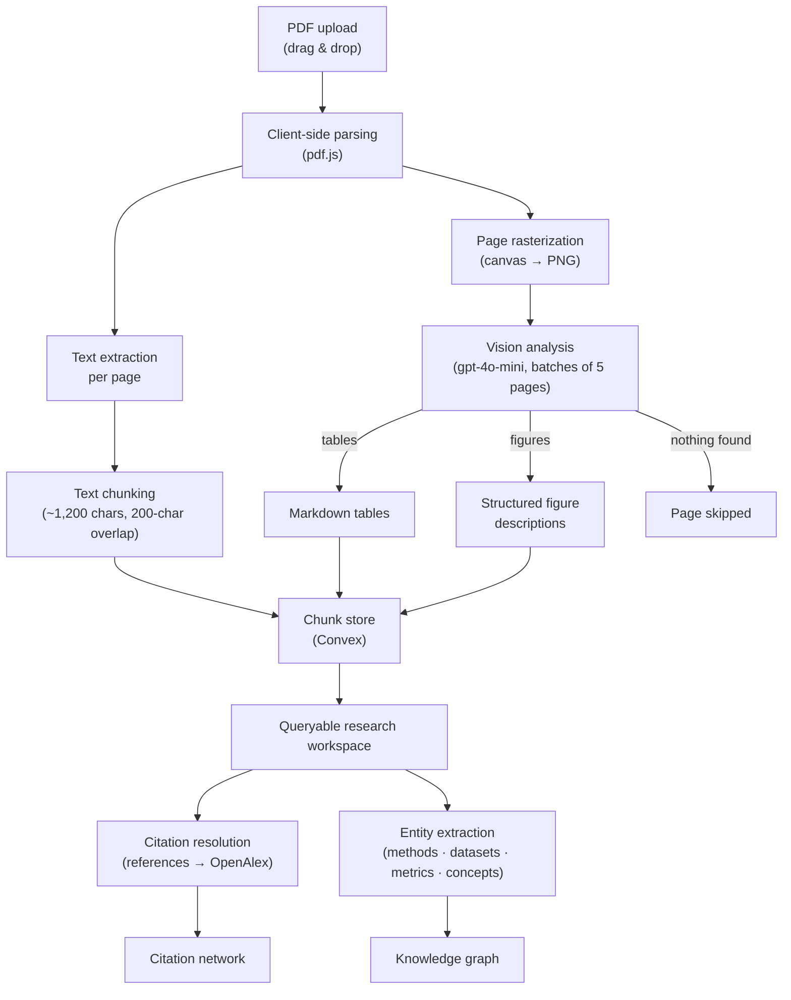
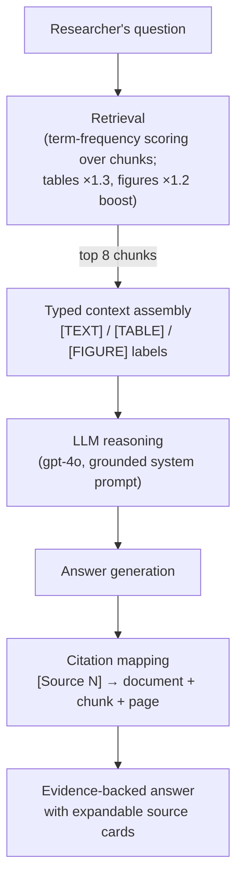
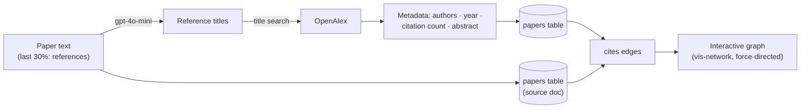
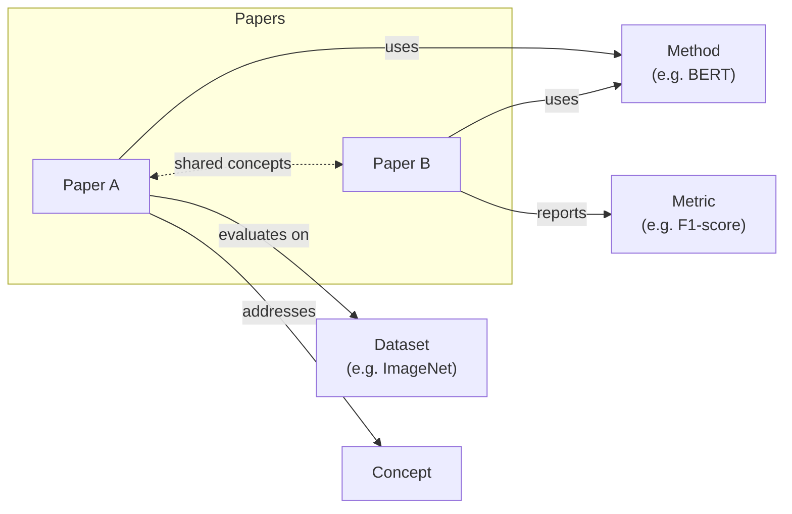
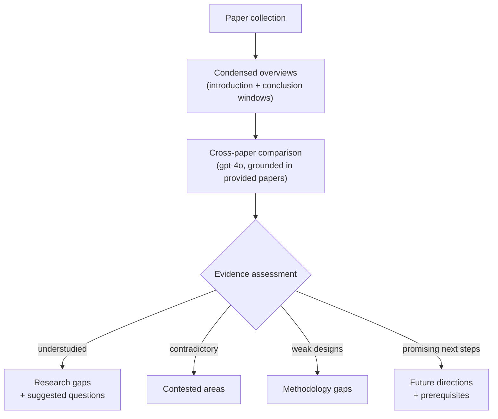

# Thesis Navigator

**An AI research assistant that turns a folder of academic PDFs into a queryable, evidence-backed research workspace.**

Thesis Navigator answers questions about your papers with citations you can verify, makes tables and figures searchable, maps citation networks and concept relationships across your library, and synthesizes research gaps from a collection of papers.


---

## Why Thesis Navigator?

Academic literature is fragmented. The knowledge you need for a thesis is scattered across dozens of PDFs — buried in methods sections, locked inside figures and tables, and spread across competing findings that rarely get compared directly.

Thesis Navigator turns a collection of papers into an interactive research workspace:

| Without | With Thesis Navigator |
| --- | --- |
| Skim hundreds of pages to find one limitation | Ask *"What are the limitations of this study?"* and get a cited answer |
| Manually transcribe tables and interpret figures | Tables and figures are extracted and searchable alongside text |
| Trace citations by hand through reference lists | Interactive citation network resolved against OpenAlex |
| Re-read three papers to find where methods disagree | Cross-paper analysis surfaces contested and missing evidence |

## What It Does

- **Evidence-backed Q&A** — ask questions across one paper or a selection; every answer cites the paper, chunk, and page it came from, with the source passage one click away.
- **Multi-modal extraction** — every PDF page is analyzed by a vision model, so tables are indexed as markdown and figures as structured descriptions, not ignored.
- **Citation network** — references are extracted from each paper, resolved against [OpenAlex](https://openalex.org) for metadata (authors, year, citation counts), and rendered as a draggable, force-directed graph.
- **Knowledge graph** — methods, datasets, metrics, and concepts are extracted per paper and linked across your entire library, showing which papers share approaches or evaluate on the same benchmarks.
- **Research gap analysis** — cross-library synthesis of what is missing, contested, or methodologically weak, with suggested research questions.
- **Novelty assessment** — per-paper analysis of novel contributions, methodology strengths/limitations, and position in the field.
- **Account-based access** — email code (OTP) and Google sign-in; no guest mode. Every user's library and history is private.

## How It Works



**Layers at a glance:**

| Layer | Technology | Purpose |
| --- | --- | --- |
| Frontend | React 19 + Vite + TypeScript | Application UI |
| Styling | Tailwind CSS v4 + shadcn/ui | Interface components and theming |
| Backend | Convex | Backend functions, database, and authentication |
| LLM | OpenAI (`gpt-4o`, `gpt-4o-mini` vision) | Q&A, table/figure extraction, entity and gap analysis |
| Metadata | OpenAlex | Academic paper metadata and citation counts |
| PDF parsing | pdf.js (client-side) | Text extraction and page rasterization |
| Graphs | vis-network | Citation network and knowledge graph visualization |

## Paper Processing Pipeline

Everything a paper contributes to the system is produced by this pipeline, which runs in the browser at upload time:



Key properties:

- **Client-side parsing** — PDF text and page images are produced in the browser; the server receives extracted text and images, not the original file.
- **Graceful degradation** — if the vision pass fails or the key is missing, papers are still usable in text-only mode.
- **Typed chunks** — every chunk is tagged `text`, `table`, or `figure` with a page number, and retrieval is aware of the type.

## Question Answering Flow



Retrieval is deliberately simple and **fully deterministic**: term-frequency scoring against the user's selected documents (with modest boosts for table and figure chunks). The LLM only ever sees the retrieved excerpts and is instructed to answer *only* from them — so every claim in an answer can be traced to a specific passage shown to the user.

## AI Research Pipeline

The AI layer has four distinct roles — retrieval, LLM reasoning, structured extraction, and graph construction — and it is worth being precise about which is which:

| Stage | What actually happens | Where |
| --- | --- | --- |
| **Retrieval** | Keyword/term-frequency scoring over stored chunks; top-k selection; type-aware boosts. No embeddings yet. | `src/convex/askQuestion.ts` |
| **LLM reasoning** | `gpt-4o` answers strictly from the retrieved context, using `[Source N]` citation notation. | `src/convex/askQuestion.ts` |
| **Structured extraction** | Vision model parses page images for tables/figures; text models extract entity lists and analyses as JSON, parsed defensively with regex + `JSON.parse` fallbacks. | `src/convex/processDocument.ts`, `extractEntities.ts`, `extractReferences.ts`, `researchAnalysis.ts` |
| **Graph construction** | Deterministic storage layer: extracted references become papers + `cites` links; entities become typed nodes shared across documents. | `src/convex/citationGraph.ts`, `openalex.ts` |

**Cross-paper analysis** (gap detection and novelty assessment) sends condensed paper overviews — introduction and conclusion windows, capped to fit the context budget — to `gpt-4o`, which must ground every identified gap in the papers actually provided. The result is a structured report: research landscape, gaps with suggested questions, contested areas, methodology gaps, and future directions.

See [`docs/ai-pipeline.md`](docs/ai-pipeline.md) for models, prompts, chunking parameters, and scoring details.

## Citation Network



Your uploaded papers are the large anchor nodes; resolved references appear as smaller nodes sized by their citation count. Edges are directional (source → cited work). Hover any node for authors, year, and citation count.

## Knowledge Graph



Entities are extracted per paper and stored once, linked to every document that mentions them. Two papers connected to the same entity — or sharing several — are linked, with the edge width proportional to how many concepts they have in common. This makes it easy to spot clusters of papers using the same methods or benchmarks.

## Research Gap Analysis



Gap analysis requires at least two papers and always operates on *your* collection — the model is instructed not to invent papers or claims that are not present in the provided material.

## Product Tour

> The images below are illustrative mockups of the actual interface, not captures of the running product. To replace them with real screenshots, see [`docs/screenshots/README.md`](docs/screenshots/README.md).

### 1. Research workspace


Organize, search, and manage your research library. Upload PDFs by drag-and-drop; each paper is processed into searchable chunks.

### 2. Paper Q&A with citations


Ask questions across selected papers and receive answers assembled only from retrieved passages. Expand any source card to read the excerpt in context before citing it.

### 3. Paper viewer with extracted content


Inspect what was extracted from each paper: text chunks, tables (as markdown), and figure descriptions, each tagged with its page number.

### 4. Citation network


Explore the research lineage of your library. Your papers are large nodes; cited works are resolved against OpenAlex and connected with directional edges.

### 5. Knowledge graph


Connect methods, datasets, metrics, and concepts across papers. Color-coded entity nodes reveal which papers share techniques or benchmarks.

### 6. Research gap analysis


Identify unresolved questions, missing evaluations, conflicting findings, and promising future directions — synthesized from your collection with suggested research questions.

## Getting Started

### Prerequisites

- **[Bun](https://bun.sh)** (v1.1+) — JavaScript runtime and package manager
- **Git**
- **Node.js 18+** — required by the Convex CLI (`npx convex`)
- API keys — see [Environment Variables](#environment-variables)

### Installation

```bash
git clone https://github.com/abdumateen/thesis-navigator.git
cd thesis-navigator
bun install
```

### Environment Variables

Copy `.env.example` to `.env.local` and fill in the frontend variable, then set the backend variables on your Convex deployment.

**Frontend (Vite) — in `.env.local`:**

| Variable | Required | Purpose |
| --- | --- | --- |
| `VITE_CONVEX_URL` | ✅ | URL of your Convex deployment (printed by `npx convex dev`) |

**Backend (Convex) — set via `npx convex env set KEY value` or the [dashboard](https://dashboard.convex.dev):**

| Variable | Required | Purpose |
| --- | --- | --- |
| `OPENAI_API_KEY` | ✅ | Q&A answers (`gpt-4o`), table/figure vision extraction, entity and gap analysis |
| `AUTH_GOOGLE_ID` / `AUTH_GOOGLE_SECRET` | for Google sign-in | Google OAuth client credentials |
| `EMAIL_API_KEY` / `EMAIL_API_URL` | for email sign-in | Transactional email endpoint for OTP codes |

Notes:

- Never commit real keys. `.env*` files are gitignored.
- Without `OPENAI_API_KEY`, uploads still work in text-only mode, but Q&A, graph processing, and gap analysis will return errors.
- Google OAuth requires an authorized redirect URI of `<your Convex site URL>/api/auth/callback/google`.
- Email OTP requires an endpoint that accepts a JSON body `{ to, subject, text, html }` with `Authorization: Bearer <EMAIL_API_KEY>` (e.g. Resend, Postmark, or a small wrapper around SMTP).

## Development

Convex code must be generated and a deployment must exist before the app will build — the frontend imports `@/convex/_generated/api`. Run the two processes in separate terminals:

**Terminal 1 — Convex (generates `_generated/`, syncs functions, streams logs):**

```bash
npx convex dev
```

The first run asks you to create or log into a Convex project and prints your deployment URL — put it in `.env.local` as `VITE_CONVEX_URL`.

**Terminal 2 — Vite dev server:**

```bash
bun dev
```

Then open the printed URL (default `http://localhost:5173`).

Useful commands:

| Command | Purpose |
| --- | --- |
| `bun run build` | Typecheck + production build |
| `bun run lint` | ESLint |
| `bunx convex dev --once` | One-shot function push + codegen |

## Project Structure

```
thesis-navigator/
├── src/
│   ├── components/          # App components
│   │   ├── ChatInterface    #   Q&A conversation with source cards
│   │   ├── LibraryGrid      #   searchable paper grid
│   │   ├── PdfUploader      #   drag-and-drop PDF pipeline (pdf.js + vision)
│   │   ├── RequireAuth      #   route guard with return-path preservation
│   │   └── ui/              #   shadcn/ui primitives (only the ones used)
│   ├── convex/              # Backend functions and schema
│   │   ├── schema.ts        #   documents, chunks, papers, links, entities, …
│   │   ├── documents.ts     #   library CRUD + chunk retrieval
│   │   ├── askQuestion.ts   #   retrieval + gpt-4o cited answering
│   │   ├── processDocument.ts   # vision table/figure extraction
│   │   ├── extractReferences.ts # reference extraction → OpenAlex resolution
│   │   ├── extractEntities.ts   # methods/datasets/metrics/concepts (NER)
│   │   ├── researchAnalysis.ts  # novelty + gap analysis
│   │   ├── citationGraph.ts     # graph storage queries/mutations
│   │   └── auth/            #   email OTP + Google providers
│   ├── hooks/               # useAuth
│   ├── lib/                 # utilities (cn)
│   └── pages/               # Landing, Auth, Dashboard, DocumentDetail,
│                            # GraphExplorer, GapAnalysis, NotFound
├── docs/
│   ├── ai-pipeline.md       # deep-dive into the AI layer
│   └── screenshots/         # product tour assets
├── vite.config.ts
└── package.json
```

## Architecture

The system is a single-page React app backed entirely by Convex — there is no separate server to run. All privileged work (LLM calls, OpenAlex lookups, database access) happens in Convex functions, which authenticate users via [Convex Auth](https://docs.convex.dev/auth) (email OTP + Google OAuth) and enforce per-user data isolation through a `userId` scope on every query and mutation.

- **Frontend → backend**: the UI subscribes to Convex queries reactively (live-updating library, conversations, graph data) and invokes actions for anything that calls external APIs.
- **Authentication**: Convex Auth with two providers — a 6-digit email OTP (15-minute expiry) and Google OAuth. Routes are guarded client-side by `RequireAuth`, and every backend function independently re-checks identity.
- **Database**: Convex tables — `documents`, `chunks`, `conversations`, `messages`, `papers`, `paperLinks`, `entities`, `users` — all indexed by user.
- **LLM layer**: four actions, each with a single responsibility (Q&A, vision extraction, entity extraction, research analysis). All use defensive JSON parsing with structured fallbacks so a malformed model response degrades to an empty report instead of an error.
- **Document processing**: runs client-side (pdf.js) to avoid uploading original PDF binaries; page images are batched (5 at a time) through the vision model to bound cost and latency.
- **Graph visualization**: vis-network with `forceAtlas2Based` physics; two views (citation, knowledge) rebuilt reactively from live Convex queries.

## Contributing

Contributions are welcome — see [`CONTRIBUTING.md`](CONTRIBUTING.md) for setup, conventions, and the PR process. Good first contributions: dark mode, BibTeX export, semantic (embedding-based) retrieval, or the project's first automated tests.

## Security

- **Secrets stay server-side.** The OpenAI and email API keys are only read inside Convex actions (`process.env`) and are never shipped to the browser.
- **Per-user isolation.** Every query and mutation scopes reads and writes by the authenticated user's ID; there is no cross-user access path.
- **Client-side parsing.** PDFs are parsed in the browser; only extracted text and page images reach the backend.
- **Auth.** OTP codes are 6 digits with a 15-minute expiry; sessions are managed by Convex Auth.
- **Reporting.** Please report vulnerabilities privately via [GitHub Security Advisories](../../security/advisories) rather than public issues.

## License

Released under the [MIT License](LICENSE).

## Roadmap

- [ ] Semantic retrieval — embeddings (OpenAI or open models) alongside the current keyword scorer
- [ ] Server-side PDF extraction to lift browser memory limits on large documents
- [ ] Citation export (BibTeX / CSL)
- [ ] Dark mode
- [ ] Streaming answers
- [ ] Figure preview images in source cards (page images are already captured at upload)
